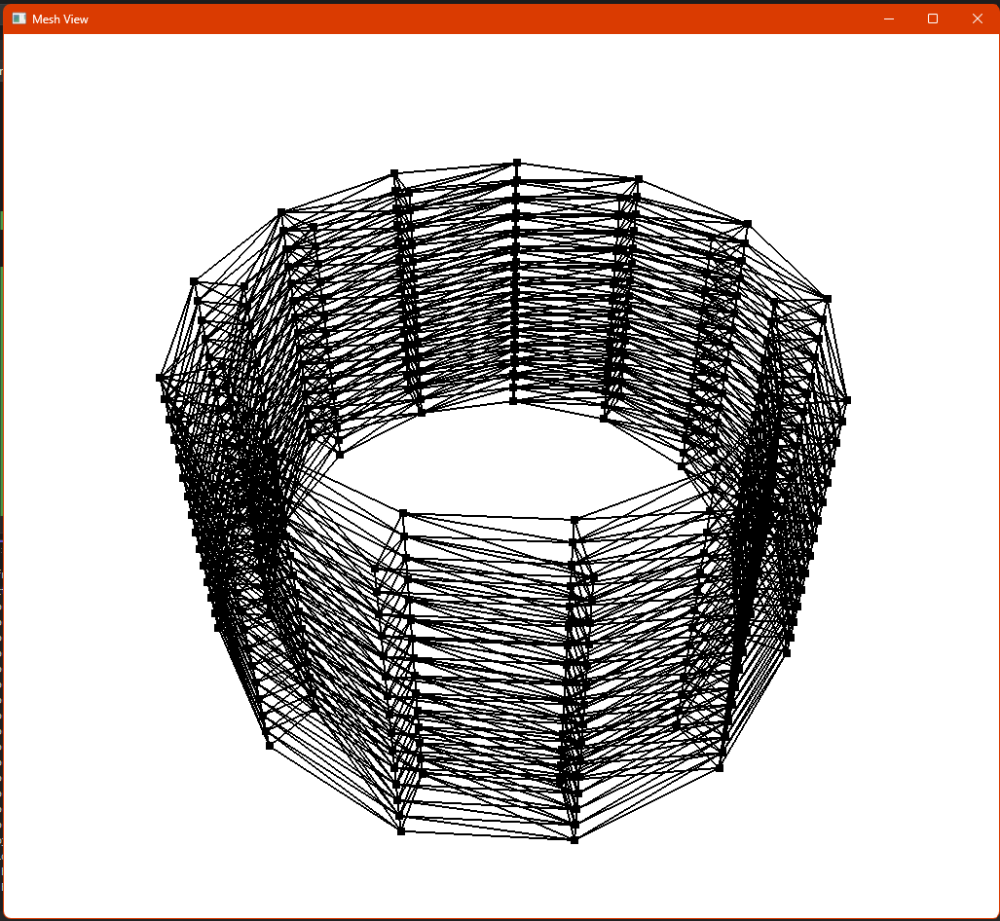
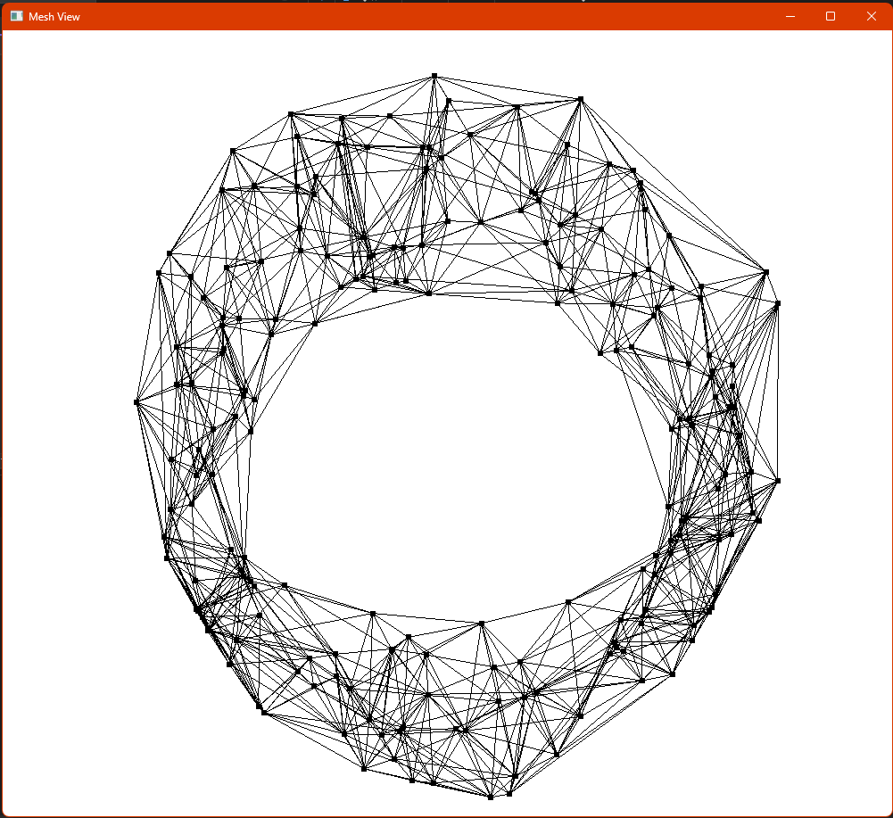

# MeshView3D

MeshView3D is a lightweight C++ project for generating and visualizing 3D tetrahedral meshes for finite element and computational geometry applications. It combines TetGen-based mesh generation with an OpenGL/GLFW viewer, making it easy to inspect mesh topology and geometry in a native window.

## Purpose

This project is intended for:

- generating 3D tetrahedral meshes from point sets,
- visualizing mesh connectivity and boundaries,
- exploring structured and unstructured volumetric meshes,
- supporting rapid inspection of finite element-style mesh data.

## Features

- Generates sample cylindrical point clouds for tetrahedral meshing
- Supports optional Gmsh-style input via .msh files
- Uses TetGen to build 3D tetrahedral meshes
- Renders the mesh in an interactive OpenGL window
- Displays mesh faces, wireframe edges, and vertices for inspection
- Includes mouse and keyboard controls for navigation

## Example Output

The viewer renders generated meshes directly in a 3D window. Example results from the repository are shown below:

## Build and Run

### Requirements

- Windows
- Visual Studio with the C++ desktop development workload
- OpenGL support

### Steps

1. Open MeshView3D.sln in Visual Studio.
2. Build the solution.
3. Run the generated executable.

The program currently generates an example cylindrical point cloud by default and visualizes the resulting tetrahedral mesh.

## Usage

The viewer supports the following interaction controls:

- Left mouse drag: rotate the view
- Scroll wheel: zoom in and out
- W/A/S/D: pan the camera view
- Esc: close the window

## Project Structure

- src/main.cpp: entry point for mesh generation and visualization
- src/meshView.cpp / src/meshView.h: OpenGL rendering and camera controls
- src/pointGenerators.cpp / src/pointGenerators.h: generation of sample point sets
- meshfiles/: sample mesh input files
- libraries/: bundled headers for GLAD, GLFW, GLM, and related dependencies
- res/: example screenshots and visual output

## Dependencies

The project uses:

- TetGen for tetrahedralization
- OpenGL for rendering
- GLFW for window creation and input
- GLAD for OpenGL function loading
- GLM for mathematics and transforms
